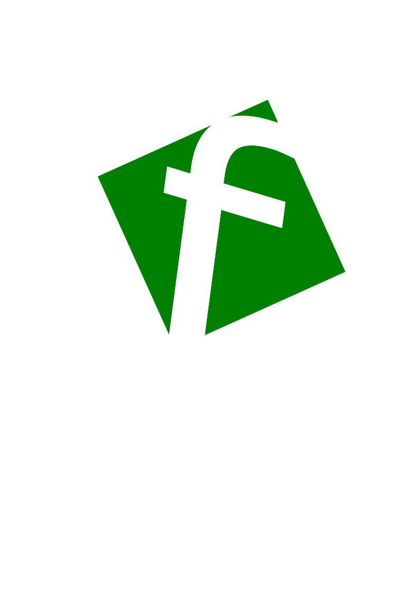

🇧🇷 [Português](README.md) | 🇺🇸 [English](README.en.md)
<h1 align="center">Flyback</h1>

<p align="center">
  
</p>

<p align="center">
  <a href="https://github.com/laravel/framework/actions"></a>
  <a href="https://packagist.org/packages/laravel/framework"></a>
  <a href="https://packagist.org/packages/laravel/framework"></a>
  <a href="https://www.gnu.org/licenses/gpl-3.0.html">
  
</a>
</p>

---

##  About the Project

**Flyback** is a collaborative platform created for students and teachers at IFPR.  
The idea is simple but powerful: to allow any user to post a **“Fly”**, meaning a suggestion, idea that can help make the institution’s environment more efficient, welcoming, and productive.

These suggestions can then be reviewed and forwarded to the appropriate administrative departments, creating a real channel for feedback and action.

---

##  Technologies Used

- **PHP 8.x**
- **Laravel 10**
- **MariaDB**
- **HTML/CSS/Blade**
- **JavaScript and Alpine.js**
- **TailwindCSS**

---

##  Features

- User registration and login  
- Creation and publication of “Flys”  
- Comment system for suggestions  
- Filtering and search functionality  
- Evaluation and forwarding to departments  
- Admin area for managing suggestions  

---

## Installation Requirements

Before starting, make sure you have the following installed on your machine:

- PHP 8.x  
- Composer  
- MariaDB  
- Node.js  

Required packages:
- Laravel Sail  
- Laravel Telescope  

```bash
# Clone the repository
git clone https://github.com/your-username/flyback.git

# Install dependencies
composer install
npm install && npm run dev

# Set up environment variables
cp .env.example .env
php artisan key:generate

# Run migrations
php artisan migrate

# Start the development server
php artisan serve
If you prefer to use Laravel Sail for running artisan commands, and you already have it installed, run:

composer require laravel/sail --dev
Then execute:


php artisan sail:install
Select the services you want to include in your docker-compose.yml.
After installation, start the containers and run the migrations:


./vendor/bin/sail up -d
./vendor/bin/sail artisan migrate
 How to Contribute
Contributions are always welcome! 
If you’d like to help improve this project, follow these steps:

Fork the repository
Create a copy of this project on your GitHub account by clicking the “Fork” button.

Clone your fork


git clone https://github.com/your-username/flyback.git
Create a new branch for your changes


git checkout -b my-new-feature
Implement your improvements and commit your changes


git commit -m "Add or update my feature"
Push your changes to your GitHub repository


git push origin my-new-feature
```
Open a Pull Request

Go to your repository on GitHub and click “New Pull Request” to propose your changes to the main project.

 Write a clear description explaining what was changed and why — this helps reviewers understand and approve your contribution faster.

# License
Flyback is open-source software licensed under the [GNU LICENSE](https://www.gnu.org/licenses/gpl-3.0.html).
